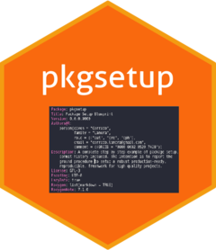

<!-- README.md is generated from README.Rmd. Please edit that file -->

```{r, include = FALSE}
knitr::opts_chunk$set(
  collapse = TRUE,
  comment = "#>",
  fig.path = "man/figures/README-",
  out.width = "100%"
)
```

# pkgsetup [](http://corradolanera.github.io/pkgsetup/) 

<!-- badges: start -->
[](https://CRAN.R-project.org/package=pkgsetup)
[](https://www.tidyverse.org/lifecycle/#maturing)
<!-- badges: end -->

The goal of `{pkgsetup}` is to provide a complete step-by-step example of
package setup, commit history included. The intention is to report the
ground procedure to setup a robust production-ready, reproducible,
framework for high quality projects.

## Installation

You can install the development version from
[GitHub](https://github.com/) with the following procedure:

```{r, eval = FALSE}
# install.packages("devtools")
devtools::install_github("CorradoLanera/pkgsetup")
```


## Usage

This package is here only to provide a blueprint for a full package
setup. You can look at its structure, and you can find all the setup
flow procedure into the file
[`dev/01-setup.R`](https://github.com/CorradoLanera/pkgsetup/blob/master/dev/01-setup.R).
You can also take a look at the history of the commits.

Happy Projecting!


## Contribution

If you have updates or better procedure/strategies to purpose, please
file an [issue](https://github.com/CorradoLanera/pkgsetup/issues).
Thanks.


## Code of Conduct

Please note that the pkgsetup project is released with a
[Contributor Code of Conduct](https://contributor-covenant.org/version/2/0/CODE_OF_CONDUCT.html).
By contributing to this project, you agree to abide by its terms.
